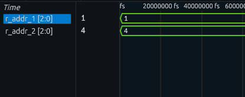
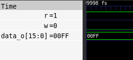

# PROJETO DE MEMÓRIAS E BANCO DE REGISTRADORES EM VHDL

## 1. Introdução
Relátorio detalhando o desenvolvimento dos componentes de armazenamento para o projeto CPU Didática 1.0. O objetivo principal é a prática de descrição de hardware em baixo nível utilizando a linguagem VHDL, focando na modelagem estrutural e comportamental de memórias e registradores.

Além de descrever os componentes, a intenção é criar módulos genéricos e parametrizáveis, permitindo flexibilidade. O código foi desenvolvido e simulado em utilizando testbenches para validar o comportamento temporal das instruções de leitura e escrita. O restante do relatório está organizado da seguinte maneira: a seção 2 trata do desenvolvimento do código; a seção 3 mostra os resultados das simulações de execução e a seção 4 conta com a conclusão do trabalho.

## 2. Desenvolvimento
Nesta seção, será apresentado o raciocínio por trás de cada componente de armazenamento da CPU, explicando o propósito de cada sinal e instrução.

Os componentes mais básicos criados foram os registradores individuais. O componente `bitregister_par` implementa um registrador de N bits com carga paralela. O seu funcionamento é atrelado à borda de subida do clock e depende de um sinal de habilitação (`Rin`):
```vhdl
process
    begin
      wait until Clock'event and Clock = '1';
        if Rin = '1' then Q <= R;
        end if ; 
      end process;
```
Para gerenciar o contexto do processador, foi construído um Banco de Registradores (reg_bank). Ele agrupa múltiplos registradores utilizando um vetor customizado. Este componente é altamente otimizado: possui duas portas de leitura (r_addr_1 e r_addr_2), o que permite que a CPU busque dois operandos simultaneamente para a ULA. A escrita, no entanto, é síncrona e ocorre apenas quando o sinal de Write Enable (w) está em nível lógico alto e ocorre a borda de subida do clock:
```vhdl
type reg_array is array(register_count - 1 downto 0) of std_logic_vector(data_width - 1 downto 0);
  signal regs : reg_array;

begin
  process (clk)
  begin
    if rising_edge(clk) then
      data_o_1 <= regs(to_integer(unsigned(r_addr_1)));
      data_o_2 <= regs(to_integer(unsigned(r_addr_2)));
      if w = '1' then
        regs(to_integer(unsigned(w_addr))) <= data_i;
      end if;
    end if;
  end process;

```
Também há a memória principal(`memory_impl`) foi descrita de forma genérica para atuar tanto como Memória de Instruções quanto de Dados. Assim como o banco de registradores, a memória utiliza um array unidimensional para armazenar a informação, permitindo operações de leitura e escrita baseadas na ativação dos pinos r (Read) e w (Write):
```vhdl
process (clk)
  begin
    if rising_edge(clk) then
      if w = '1' then
        mem(to_integer(unsigned(addr))) <= data_i;
      elsif r = '1' then
        data_o <= mem(to_integer(unsigned(addr)));
      end if;
    end if;
  end process;
```

## 3. Resultados Obtidos
Nesta seção, ocorrerá testes para validação de que o código funciona como esperado, medindo a integridade dos dados através das simulações dos testbenches.

### 3.1. Estudo de Caso 1: Banco de registradores
Neste estudo, o testbench reg_bank_tb utiliza um loop de repetição para automatizar a escrita em todos os endereços do banco. Ao final do loop, as portas de leitura são forçadas para os endereços "001" e "100".



### 3.2. Estudo de Caso 2: Memória Principal com TextIO
Para testar a memória (`memory_tb`), foi utilizada uma abordagem avançada de verificação: a leitura de um arquivo externo `memoria.txt` utilizando a biblioteca `std_logic_textio`.
```vhdl
if not endfile(mem_file) and addr_i <= Z - 1 then
        w <= '1';
        readline(mem_file, line_v);
        read(line_v, value);
        addr <= std_logic_vector(to_unsigned(addr_i, X));
        data_i <= value;
```
      
       
O processo inicia lendo o arquivo de texto linha por linha. Enquanto o arquivo não chega ao fim, o sinal w é ativado. Após preencher os dados, o pino r é ativado e a memória é lida sequencialmente. O waveform confirma que o dado extraído em data_o é perfeitamente fiel ao que foi introduzido via arquivo.

# 4. Conclusão
A abstração de componentes de armazenamento em VHDL foi realizada com sucesso. Ficou claro na prática a diferença entre lógicas combinacionais e lógicas sequenciais dependentes de clock. A modelagem do Banco de Registradores com leitura de porta dupla provou ser uma solução elegante para alimentar a ULA de forma eficiente, enquanto a utilização da biblioteca `textio` para ler as instruções da memória diretamente de um arquivo `.txt` aproximou a simulação do carregamento real de um firmware na arquitetura.

ajeitar para modo tutorial as docs