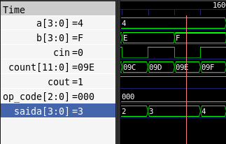
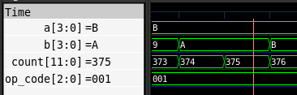

# Projeto de Unidade Lógica e Aritmética (ULA) em VHDL

# 1. Introdução
Este relatório detalha o desenvolvimento do núcleo de processamento matemático de uma CPU parcial, abordando a construção de Unidades Lógicas e Aritméticas (ULAs) em linguagem VHDL para o projeto de iniciação científica CPU Didática. A intenção do projeto foi iniciar a abstração a partir do nível de portas lógicas (ULA de 1 bit) e escalar o componente para processar múltiplos bits simultaneamente (ULA de N bits).

# 2. Desenvolvimento
Nesta seção, será apresentado o código dos componentes.

```vhdl
  Saida <= A xor B xor Cin;
  Cout  <= (A and B) or (A and Cin) or (B and Cin);
```

A partir dele, foi construída a ULA de 1 bit. Este módulo recebe um `op_code` de seleção e atua como uma grande central: paralelamente, ele calcula `AND`, `OR`, `NOT` e a soma. A operação de subtração é alcançada utilizando o método de Complemento 2: quando o `op_code` indica uma subtração (`001`), o sinal interno `B_seletivo` inverte o bit de `B`. A saída final `Saida` é filtrada utilizando a estrutura `when ... else` atuando como um multiplexador:

```vhdl
  Saida <= fio_full_adder when (op_code = "000" or op_code = "001") else
    fio_and when (op_code = "010") else
    fio_or when (op_code = "011") else
    fio_not when (op_code = "100") else
    '0';
```

Para criar a `ula_Nbits`, invés de reescrever toda a lógica, foi adotada a parametrização através da declaração `generic`. Um laço de geração estrutural (`for ... generate`) instancia múltiplas ULAs de 1 bit lado a lado, configurando um somador do tipo Ripple Carry. O carry out de uma etapa é mapeado diretamente para o carry in da etapa seguinte no vetor de sinais internos carries:
```vhdl
carries(0) <= '1' when (op_code = "001") else Cin;
  ULA : for i in 0 to bits - 1 generate
    ULA_i : entity work.ula_1bit
      generic map( bitsOperations => bits_op_code )
      port map
      (
        A       => A(i),
        B       => B(i),
        Cin     => carries(i),
        op_code => op_code,
        Saida   => Saida(i),
        Cout    => carries(i + 1)
      );
  end generate;
```

# 3. Resultados Obtidos
Para validar o circuito e garantir que a ligação estrutural de carry não possua atrasos críticos ou erros, estudo de casos foram executados.

### 3.1. Estudo de caso 1: Teste do Somador Parametrizado
O componente `somadorNbits` foi testado isoladamente (`somador_Nbits_tb`) passando por testes de caso tradicionais.



Os valores aplicados comprovaram seu funcionamento: um teste de overflow proposital foi feito somando 0100 (4) com 1111 (15), resultando na saída 0000 com o sinal de Cout ativo em '1', validando o comportamento esperado.

### 3.2. Estudo de caso 2: Varredura de Sinais da ULA de N Bits
Para a `ula_Nbits_tb`, foi utilizada uma estratégia de teste exaustivo. Um sinal do tipo `unsigned` chamado `count` foi criado com largura suficiente para englobar todas as variáveis de entrada concatenadas (`op_code`, `A`, `B` e `Cin`).

```vhdl
  op_code <= std_logic_vector(count(totalBits - 1 downto 2 * bits + 1));
  A       <= std_logic_vector(count(2 * bits downto bits + 1));
  B       <= std_logic_vector(count(bits downto 1));
  Cin     <= count(0);
```



A cada 10 ns de simulação, o contador é incrementado e suas fatias (slices) são mapeadas para as portas da ULA. Isso garante que a simulação passe por todas as combinações matemáticas e lógicas possíveis.

# 4. Conclusão
A construção da ULA consolidou o entendimento sobre a organização e parametrização do fluxo de dados (datapath). A modularização do código — criando uma ULA básica de 1 bit para então escalá-la para um componente robusto e genérico através de blocos generate — tornou o código limpo, de fácil manutenção e perfeitamente aplicável para o núcleo de execução de qualquer arquitetura de processador.
