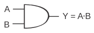

# Fundamentos

Abaixo, você vai entender de forma simplificada o que é uma CPU, como ela toma decisões usando Portas Lógicas e como usamos a linguagem VHDL para "desenhar" tudo isso.

***

### 1. O que é uma CPU?

A CPU (Unidade Central de Processamento) é popularmente conhecida como o "cérebro" de qualquer dispositivo eletrônico, desde o seu smartphone até o seu computador. É ela a responsável por ler instruções da memória e executar todos os cálculos e comandos necessários para que os programas funcionem.

No nosso projeto, estamos simulando uma CPU de 16 bits. Isso significa que as "vias" (barramentos) por onde as informações passam e os cálculos realizados lidam com pacotes de 16 zeros e uns (bits) de uma única vez.

Para que a CPU funcione, ela é dividida em blocos menores, sendo os principais:

* _ULA (Unidade Lógica e Aritmética)_: É o bloco responsável por fazer somas, subtrações e comparações entre os bits.
* _Registradores:_ Pequenas "caixas" de memória ultrarrápidas que guardam os bits enquanto a CPU faz as contas.
* _Unidade de Controle_: O "maestro" que organiza tudo. Ele lê a instrução e diz para a ULA e para os Registradores o que eles devem fazer no momento exato.

***

### 2. O que são Portas Lógicas?

As Portas Lógicas são circuitos eletrônicos que operam sob os princípios da Álgebra Booleana. Elas constituem as unidades funcionais elementares de qualquer sistema digital, processando sinais de entrada para gerar uma saída baseada em uma função lógica específica.

Diferente da computação analógica, onde os sinais variam continuamente, nas portas lógicas trabalhamos com estados discretos: o nível lógico alto ($$1$$ ou _True_) e o nível lógico baixo ($$0$$ ou _False_), representados fisicamente por diferentes tensões elétricas.

Existem algumas portas básicas que fazem operações simples com a eletricidade:

* Porta AND: Só emite sinal `1` na saída se todas as entradas forem `1`. É como um sistema de segurança que só destrava a porta se o cartão _E_ a senha estiverem corretos.

<figure><figcaption></figcaption></figure>

* Porta OR: Emite sinal `1` se pelo menos uma das entradas for `1`.

<figure><figcaption></figcaption></figure>

* Porta NOT: Serve para inverter o sinal. Se entra `1`, sai `0`. Se entra `0`, sai `1`.

<figure><figcaption></figcaption></figure>

* Porta NAND: serve para sei la oq

<figure><figcaption></figcaption></figure>

* Porta NOR: blablblabla

<figure><figcaption></figcaption></figure>

Combinando e agrupando milhares dessas portas lógicas, nós conseguimos criar uma ULA capaz de somar números complexos e, a partir disso, construir uma CPU inteira.

***

### 3. O que é VHDL?

Para compreender o VHDL (_VHSIC Hardware Description Language_), é preciso primeiro desaprender o conceito tradicional de programação.

Em linguagens como Python, JavaScript ou Java, você desenvolve Software. Este software é um conjunto de instruções lógicas que um processador (hardware pré-existente) executa de forma sequencial, uma após a outra. O foco aqui é o algoritmo.

O VHDL não é uma linguagem de programação, mas sim uma Linguagem de Descrição de Hardware. Ao escrever em VHDL, você não está ditando o que um processador deve "fazer", mas sim descrevendo o que o hardware é.

### Abstração de Circuito&#x20;

Em vez de passos lógicos, você descreve conexões, barramentos, portas lógicas e flip-flops.

### Concorrência

Diferente do software, onde uma linha roda após a outra, no hardware tudo acontece ao mesmo tempo (concorrentemente). Se você conecta um fio a uma porta lógica, o sinal flui instantaneamente por todo o circuito, não sendo sequencial linha a linha.

***

#### Do Texto ao Silício: O Processo de Síntese

No contexto do projeto da CPU Didática, o código VHDL funciona como o blueprint (planta técnica) do processador:

1. Descrição: O arquivo VHDL define como a Unidade de Controle se comunica com os Registradores e como a ULA (Unidade Lógica e Aritmética) processa os dados.
2. Síntese: Através de ferramentas especializadas, esse texto é convertido em uma _Netlist_ — um mapa de conexões físicas entre componentes eletrônicos.
3. Simulação: Ferramentas como o GHDL e o GTKWave permitem realizar uma "autopsia digital" do projeto. Elas geram diagramas de tempos (_waveforms_), onde podemos visualizar as oscilações de tensão (0s e 1s) e validar se a arquitetura se comporta como esperado antes mesmo de ser implementada em um chip físico (como um FPGA).

***

#### Por que isso é importante?

Escrever em VHDL permite que engenheiros projetem circuitos complexos com a mesma facilidade com que um programador escreve um site, mas com o resultado final sendo um componente físico otimizado, capaz de realizar tarefas em nanosegundos com uma eficiência que nenhum software rodando em uma CPU genérica conseguiria alcançar.

***

O seu "Resumo da Obra" está excelente para fechar com chave de ouro, mas podemos dar um toque mais profissional e impactante, utilizando termos que reforçam a engenharia por trás do projeto.

Aqui está uma versão refinada, estruturada para mostrar a evolução do conceito até o hardware funcional:

***

### Do Pulso Elétrico ao Processamento de Dados

Para consolidar o que foi visto, pode-se enxergar a construção da CPU como uma pirâmide de abstrações:

* A Base Binária: O universo digital opera exclusivamente em estados binários (0s e 1s), que nada mais são do que a presença ou ausência de tensão elétrica em um circuito.
* A Lógica Matemática: Através das Portas Lógicas, transformamos eletricidade em decisões. Elas são os componentes fundamentais que aplicam as regras da Álgebra Booleana para manipular os dados.
* A Arquitetura Descritiva: O VHDL atua como a nossa ferramenta de design de precisão. Em vez de desenhar trilhas à mão, utilizamos uma linguagem de alto nível para descrever a estrutura e o comportamento dos componentes eletrônicos.
* O Hardware Funcional: A união dessas camadas resulta em uma CPU de 16 bits. O que antes era apenas texto e lógica, torna-se um sistema complexo capaz de realizar cálculos, gerenciar memória e executar programas de forma autônoma.
